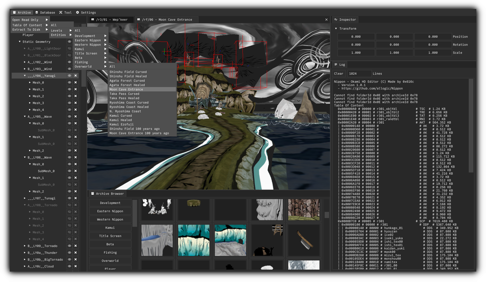
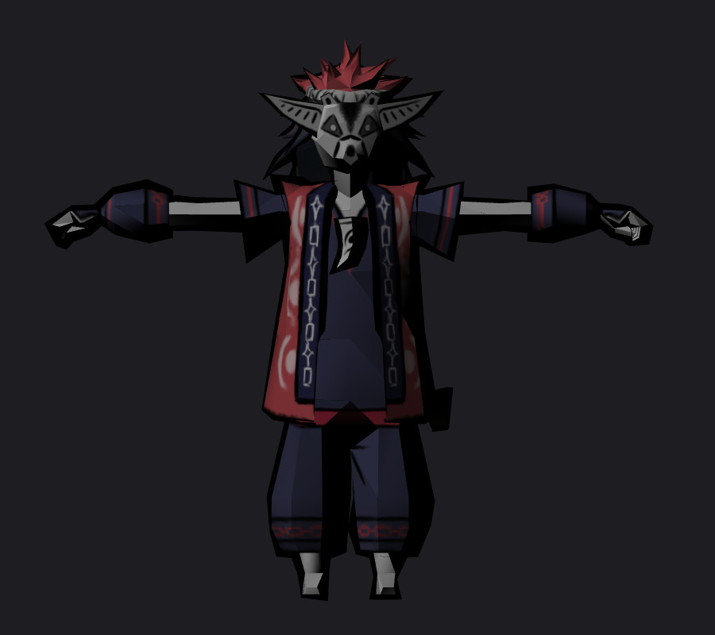

# Nippon Modding Framework
Nippon is a collection of tools designed to interact with the okami PC port. This project is in it's very early days and by all means not production ready.



## Starting The Editor
The editor requires 2 command line arguments. The first one is the directory where the okami data files are and the other is the BlowFish-256 key which has already been leaked. Both arguments must be supplied as strings!
```
Editor.exe <okami-data-pc-dir> <cipher-key>
Editor.exe "...\Steam\steamapps\common\Okami\data_pc" "YaKiNiKuM2rrVrPJpGMkfe3EK4RbpbHw"
```

## Compile The Project
First clone the repository and execute the setup which should create all missing folders and files.
```
git clone --branch main --depth 1 https://github.com/allogic/Nippon
Setup.ps1
```
Launch the Visual Studio Solution, set the `Editor` as the startup project and build for `Debug` or `Release` bitness `x64`.
To run or debug the editor one must additionally adjust a few editor properties. Go into `Editor/Properties/Debugging` and set the following parameters for all configurations and platforms:
```
Command Arguments = <okami-data-pc-dir> <cipher-key>
Working Directory = $(SolutionDir)$(IntDir)
```

## Utility Programs
There are a few utility programs which simplify a couple steps:
#### Archive Analyzer
```
ArchiveAnalyzer.exe Decrypt <cipher-key> <input-file> <output-file>
ArchiveAnalyzer.exe Encrypt <cipher-key> <input-file> <output-file>
ArchiveAnalyzer.exe Unpack <input-file> <output-file>
ArchiveAnalyzer.exe ToC <input-file>
ArchiveAnalyzer.exe CollectTypes <input-file>
```
Here is a short how to:
```
ArchiveAnalyzer.exe Decrypt "YaKiNiKuM2rrVrPJpGMkfe3EK4RbpbHw" "...\Steam\steamapps\common\Okami\data_pc\etc\core.dat" "core.dat"
ArchiveAnalyzer.exe Unpack "core.dat" "core"
ArchiveAnalyzer.exe ToC "core.dat"
    |   00000 # kage                 # DDS  # 22.80 KB
    |   00001 # fude1                # DDS  # 22.80 KB
    |   00002 # fude2                # DDS  # 349.760 KB
    |   00003 # coreVtEstTbl         # VET  # 2.976 KB
    |   00004 # coreEff              # EFF  # 25387.488 KB
    |   |   00000 # coretex              # TBL  # 24738.208 KB
    |   |   00001 # coreest              # TBL  # 397.152 KB
    |   |   00002 # core                 # EMD  # 251.936 KB
    |   |   00003 # runofs               # ROF  # 0.96 KB
    |   00005 # Fu00Eff              # EFF  # 433.632 KB
    |   |   00000 # fu00tex              # TBL  # 0.128 KB
    |   |   |   00000 # runofs               # ROF  # 0.64 KB
    |   |   00001 # fu00est              # TBL  # 433.248 KB
    |   |   00002 # fu00                 # EMD  # 0.64 KB
    |   |   00003 # runofs               # ROF  # 0.96 KB
    |   00006 # PL00Eff              # EFF  # 314.176 KB
    |   |   00000 # pl00tex              # TBL  # 0.128 KB
    |   |   |   00000 # runofs               # ROF  # 0.64 KB
    |   |   00001 # pl00est              # TBL  # 313.792 KB
    |   |   00002 # pl00                 # EMD  # 0.64 KB
    |   |   00003 # runofs               # ROF  # 0.96 KB
    |   00007 # animalSet            # ANC  # 1.120 KB
    |   00008 # runofs               # ROF  # 0.128 KB
```
#### Binary Analyzer
```
BinaryAnalyzer.exe Compare <input-file-left> <input-file-right>
BinaryAnalyzer.exe Search <input-file> <byte-pattern>
```

## Troubleshooting
 - If you got build errors, make sure you are using the latest Visual Studio version. (Tested with VS 2022 >= 17.X.X)
 - If for some reason the editor does not start, make sure the latest graphics card drivers are installed on your system.
 - If only black thumbnails appear, then one must first generate them via `MainMenu/Tools/Generate Thumbnails`. They should be visible after editor relaunch.

## Exporting Assets
Right click on a random actor that you wish to export and choose `Export as Wavefront` to generate a wavefront object and material file. It should be ready to be imported into blender or other 3D software. Be sure to enable backface culling in your external rendering software to view the objects properly, otherwise only the black hull will be visible for most objects.



## Editor Scene Controls
- `WASD` to move
- `L-SHIFT` for lightspeed

## Issues / Pull Requests
If bugs are being found, please don't hesitate to open an issue or pull request!

## Resources
#### Links
- Wiki https://okami.speedruns.wiki
- Discord https://discord.gg/fbJdaeb
#### Repositories
- https://github.com/Shintensu/OkamiHD-Reverse-Engineering
- https://github.com/whataboutclyde/okami-utils
#### Old File Extension List
```
AFD - unknown purpose but are small and contain no multimedia.
AFS - if an AFS file is a subfile than it only contains audio, usually a few. Game Extractor can extract these but if you have try after you exact the big one (if some one can optimize the script then this should be displayed as a folder)
BIN - These are sub archives that Game Extractor can't really extract properly. The format is easy the first 4bytes are the number of files. then the next 4 bytes are all of the file offsets, then there are text extensions (4bytea for all of the files possible extensions include:
ANS - These are blank 16bytes strange
AKT - Contain Collision Maps and Terrain type Maps (ie is is dirt, water mud ect)
BMH - Contain mostly floats possibly level terrain related contain the header BMH
CAM - Unknown purpose contain the header mtb3 (in lowercase)
CCH - Contain mostly floats probably map related no real header
DRH - Related or identical to the SCH files, no real header mostly floats
EFF - are similar or identical to the BIN archives
FI2 - These contain object placement data
ITS - Contain no floats possibly map related no real header
LI3 - Contain some floats unknown purpose
MEH - Are small contain mostly floats have the header MEH
MOT - Unknown Contain the header mtb3 (in lowercase)
MSD - which is itself a sub-sub file archive. It contains no header and begins with the relative positions of the files it contains. Maybe it is collision map data, but it does not use floats
MSA - Contains no header other than the size of the whole file, no floats maybe texture meta data
MST - really small no header no file size no floats ect
RNI - These are small, Unknown purpose no real header
SCH - These contain mostly Floats probably related to map boundary lines-contain no real header
SCR - These contain the Header scr (in lowercase) these are model archives for level terrain that use 16bytesigned vertexes similar to MD archives that contain character meshes
SEQ - Probably animation data
T32 - These are some sort of Tim2 textures but DO NOT contain the text header TIM2
T3L - same as BIN archive
TM2 - These are regular Tim2 textures that DO contain the standard TIM2 text header
TRE - Unknown related to TSC contain no real header
TS  - Possibly related to camera movement these contain the header TS
TSC - Unknown releated to TSC contain no real header
TST - Same as the BIN archive
BMT - These are small files unknown purpose
D   - The ones on the demo are archives that only contain 1 of each of the following
MPD - contain Meta data for the textures no real header
DAT - similar to BIN archives contain many files and models:
MD  - Contain the Header scr (in lowercase) + five 00 bytes+ the number of models (4bytes)+ four 00 bytes + The offsets to the models
MDB - These are the models packages and contain the submeshes+yet another type of Tim2 textures
DIR - a small text file with the name of the path to the video files
S   - some type of audio or video adx format??? this file might be the promational video for the full version of okami
SES - Audio
SFD - Audio
TBL - (map.tbl) This looks like a source code map, or at least ALL of the functions in the ELF file (PS2 Excutable file) this could easily be into hacks, but the file might not be included in the full version of the game
TM2 - (moji8.tm2) a Tim2 texture of the letters used in for menus and character speech.
```
